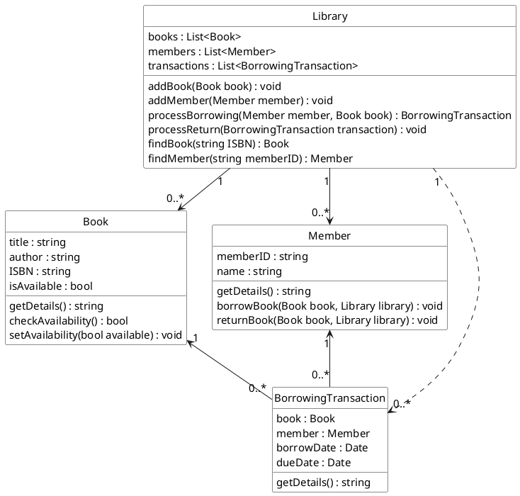

## Design exercises

#### Exercise A

###### Sample CRC Cards:

![[crc.svg]]
###### Sample scenario walkthroughs:

Member Borrows a Book:
1. Member calls `borrowBook(book, library)` on the Library.
2. Library checks if the Member is valid.
3. Library checks if the Book is available.
4. Library creates a new BorrowingTransaction object.
5. BorrowingTransaction records the Book, Member, and borrow date.
6. Library updates the Book's availability status.
7. Library adds the BorrowingTransaction to its list of transactions.
8. Library returns the BorrowingTransaction to the Member.

Member Returns a Book:
1. Member calls `returnBook(book, library)` on the Library.
2. Library finds the corresponding BorrowingTransaction.
3. Library updates the Book's availability status.
4. Library removes the BorrowingTransaction from its list.

Librarian Adds a New Book:
1. Librarian creates a new Book object.
2. Librarian calls `addBook(book)` on the Library.
3. Library adds the Book to its list of books.

Librarian Adds a New Member:
1. Librarian creates a new Member object.
2. Librarian calls `addMember(member)` on the Library.
3. Library adds the Member to its list of members.

--- 
#### Exercise B

###### Sample class diagram:


--- 
#### Exercise C

###### Sample C# class code based on the class diagram:

```csharp
using System;
using System.Collections.Generic;

public class Book
{
    public string Title { get; set; }
    public string Author { get; set; }
    public string ISBN { get; set; }
    public bool IsAvailable { get; set; }

    public Book(string title, string author, string isbn)
    {
        Title = title;
        Author = author;
        ISBN = isbn;
        IsAvailable = true;
    }

    public string GetDetails()
    {
        return $"Title: {Title}, Author: {Author}, ISBN: {ISBN}, Available: {IsAvailable}";
    }
}

public class Member
{
    public string MemberID { get; set; }
    public string Name { get; set; }

    public Member(string memberID, string name)
    {
        MemberID = memberID;
        Name = name;
    }

    public string GetDetails()
    {
        return $"Member ID: {MemberID}, Name: {Name}";
    }

    public void BorrowBook(Book book, Library library)
    {
        library.ProcessBorrowing(this, book);
    }

    public void ReturnBook(Book book, Library library)
    {
        library.ProcessReturn(library.FindTransaction(this, book));
    }
}

public class BorrowingTransaction
{
    public Book Book { get; set; }
    public Member Member { get; set; }
    public DateTime BorrowDate { get; set; }
    public DateTime DueDate { get; set; }

    public BorrowingTransaction(Book book, Member member)
    {
        Book = book;
        Member = member;
        BorrowDate = DateTime.Now;
        DueDate = BorrowDate.AddDays(14);
    }

    public string GetDetails()
    {
        return $"Book: {Book.Title}, Member: {Member.Name}, Borrow Date: {BorrowDate}, Due Date: {DueDate}";
    }
}

public class Library
{
    private List<Book> books = new List<Book>();
    private List<Member> members = new List<Member>();
    private List<BorrowingTransaction> transactions = new List<BorrowingTransaction>();

    public void AddBook(Book book)
    {
        books.Add(book);
    }

    public void AddMember(Member member)
    {
        members.Add(member);
    }

    public BorrowingTransaction ProcessBorrowing(Member member, Book book)
    {
        if (!members.Contains(member))
        {
            Console.WriteLine("Member not found.");
            return null;
        }

        if (!books.Contains(book))
        {
            Console.WriteLine("Book not found.");
            return null;
        }

        if (!book.IsAvailable)
        {
            Console.WriteLine("Book is not available.");
            return null;
        }

        BorrowingTransaction transaction = new BorrowingTransaction(book, member);
        transactions.Add(transaction);
        book.IsAvailable = false;
        return transaction;
    }

    public void ProcessReturn(BorrowingTransaction transaction)
    {
        if (transaction != null)
        {
            transaction.Book.IsAvailable = true;
            transactions.Remove(transaction);
        }
    }

    public Book FindBook(string isbn)
    {
        return books.Find(book => book.ISBN == isbn);
    }

    public Member FindMember(string memberID)
    {
        return members.Find(member => member.MemberID == memberID);
    }

    public BorrowingTransaction FindTransaction(Member member, Book book)
    {
        return transactions.Find(transaction => transaction.Member == member && transaction.Book == book);
    }
}

public class Program
{
    public static void Main(string[] args)
    {
        Library library = new Library();

        Book book1 = new Book("The Hitchhiker's Guide to the Galaxy", "Douglas Adams", "978-0345391803");
        Book book2 = new Book("Pride and Prejudice", "Jane Austen", "978-0141439518");

        Member member1 = new Member("M001", "Alice");
        Member member2 = new Member("M002", "Bob");

        library.AddBook(book1);
        library.AddBook(book2);
        library.AddMember(member1);
        library.AddMember(member2);

        Console.WriteLine("Book 1 details before borrow: " + book1.GetDetails());
        
        member1.BorrowBook(book1, library);
        Console.WriteLine("Book 1 details after borrow: " + book1.GetDetails());
        Console.WriteLine("Transaction details after borrow: " + library.FindTransaction(member1, book1).GetDetails());

        member1.ReturnBook(book1, library);
        Console.WriteLine("Book 1 details after return: " + book1.GetDetails());
        Console.WriteLine("Transaction details after return: " + library.FindTransaction(member1, book1)?.GetDetails());
    }
}
```