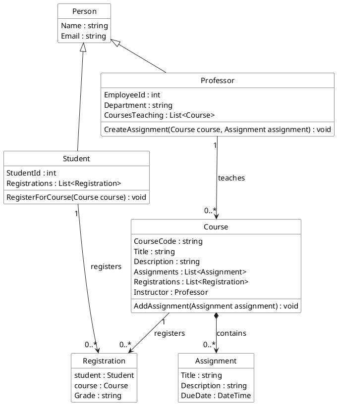
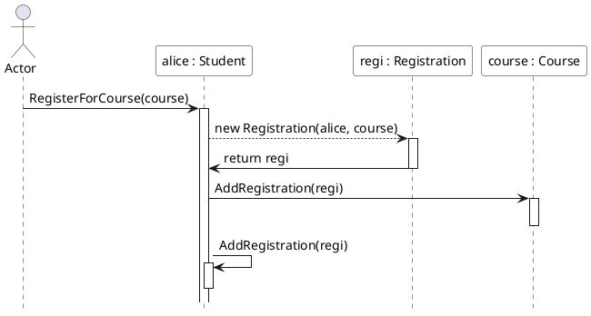
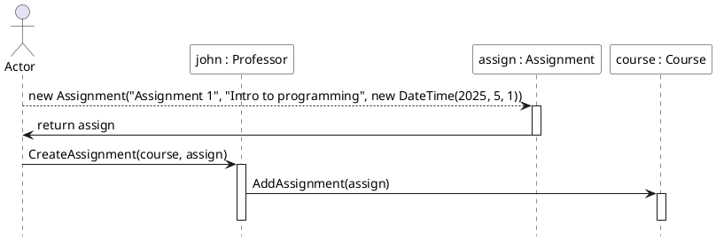

## Design exercises

---
#### Exercise A

The following class diagram defines the classes and their relationships. Notice that:
- Inheritance is used to derive `Student` and `Professor` from `Person`.
- The `Course` class _composes_ one or more `Assignment` objects. This indicates that an assignment is part of a course, and its life cycle is tightly bound to that of the course.
- The `Registration` class links a `Student` with a `Course`.



---

#### Exercise B

###### Object Diagram 1: Student Course Registration

```plantuml-svg
@startuml
skinparam defaultFontSize 15
skinparam backgroundColor white
skinparam object {
    BackgroundColor white
}

object "john : Professor" {
  EmployeeId = 101
  Department = "Computer Science"
  CoursesTeaching = [courseCS101]
  Name = "John Doe"
  Email = "j.doe@university.edu"
}

object "courseCS101 : Course" {
  CourseCode = "CS101"
  Title = "Introduction to Computer Science"
  Description = "Fundamentals of CS"
  Assignments = [assign1]
  Registrations = [regi1]
  Instruct = john
}

object "assign1 : Assignment" {
  Title = "Assignment 1"
  Description = "Intro to programming"
  DueDate = "2025-05-01"
}

object "alice : Student" {
  StudentId = 201
  Name = "Alice Smith"
  Email = "a.smith@student.university.edu"
  Registrations = [regi1]
}

object "regi1 : Registration" {
  student = alice
  course = courseCS101
  Grade = "Not Graded"
}

' Showing composition and associations
"courseCS101 : Course" -- "assign1 : Assignment" : contains
"courseCS101 : Course" -- "john : Professor" : taught by
"alice : Student" -- "regi1 : Registration" : registration
"regi1 : Registration" -- "courseCS101 : Course" : for course

@enduml
```

###### Object Diagram 2: Professor Managing Multiple Courses

```plantuml-svg
@startuml
skinparam defaultFontSize 15
skinparam backgroundColor white
skinparam object {
    BackgroundColor white
}

object "jane : Professor" {
  EmployeeId = 102
  Department = "Mathematics"
  CoursesTeaching = [courseMATH201,courseMATH202]
  Name = "Jane Doe"
  Email = "j.doe@university.edu"
}

object "courseMATH201 : Course" {
  CourseCode = "MATH201"
  Title = "Calculus II"
  Description = "Advanced calculus topics"
  Assignments = [assignCalc]
  Registrations = [alice,...]
  Instruct = jane
}

object "assignCalc : Assignment" {
  Title = "Integration Techniques"
  Description = "Practice integration methods"
  DueDate = "2025-06-15"
}

object "courseMATH202 : Course" {
  CourseCode = "MATH202"
  Title = "Linear Algebra"
  Description = "Matrix theories and applications"
  Assignments = [assignMatrix]
  Registrations = [bob,...]
  Instruct = jane
}

object "assignMatrix : Assignment" {
  Title = "Matrix Operations"
  Description = "Solve matrix problems"
  DueDate = "2025-06-20"
}

' Create composition relationships
"courseMATH201 : Course" -- "assignCalc : Assignment" : contains
"courseMATH202 : Course" -- "assignMatrix : Assignment" : contains

' Associate professor with courses
"jane : Professor" -- "courseMATH201 : Course" : teaches
"jane : Professor" -- "courseMATH202 : Course" : teaches

@enduml
```

---

#### Exercise C

###### Sequence Diagram 1: Student Course Registration




**Explanation:**

- The actor (for Student) initiates a call on its own `RegisterForCourse` method.
- The Student creates a new `Registration` object associating itself with the Course.
- The Student then adds the newly created Registration to the Course’s list.
- Finally, student adds the newly created Registration to its own list.
###### Sequence Diagram 2: Professor Posting an Assignment



**Explanation:**
- The actor (for Professor) creates a new Assignment.
- Then, the actor triggers the `CreateAssignment` operation on the Professor object, providing the target Course and the newly created Assignment.
- Next, the Professor instructs the target Course to add the Assignment via its `AddAssignment` method.

---
#### Exercise D

```csharp
using System;
using System.Collections.Generic;

namespace UniversityRegistration
{
    // Base class Person
    public abstract class Person
    {
        public string Name { get; set; }
        public string Email { get; set; }
        
        protected Person(string name, string email)
        {
            Name = name;
            Email = email;
        }
    }
    
    // Derived class Student
    public class Student : Person
    {
        public int StudentId { get; set; }
        public List<Registration> Registrations { get; set; }
        
        public Student(int studentId, string name, string email) : base(name, email)
        {
            StudentId = studentId;
            Registrations = new List<Registration>();
        }
        
        // Method to register for a course
        public void RegisterForCourse(Course course)
        {
            Registration registration = new Registration(this, course);
            Registrations.Add(registration);
            course.Registrations.Add(registration);
            Console.WriteLine($"{Name} registered for {course.CourseCode}");
        }
    }
    
    // Derived class Professor
    public class Professor : Person
    {
        public int EmployeeId { get; set; }
        public string Department { get; set; }
        public List<Course> CoursesTeaching { get; set; }
        
        public Professor(int employeeId, string name, string email, string department) 
            : base(name, email)
        {
            EmployeeId = employeeId;
            Department = department;
            CoursesTeaching = new List<Course>();
        }
        
        // Method to add an assignment to a course
        public void CreateAssignment(Course course, Assignment assignment)
        {
            if (CoursesTeaching.Contains(course))
            {
                course.AddAssignment(assignment);
                Console.WriteLine($"{Name} added assignment '{assignment.Title}' to {course.CourseCode}");
            }
            else
            {
                Console.WriteLine($"{Name} does not teach course {course.CourseCode}");
            }
        }
    }
    
    // Course class
    public class Course
    {
        public string CourseCode { get; set; }
        public string Title { get; set; }
        public string Description { get; set; }
        // Composition: Course is composed of Assignments
        public List<Assignment> Assignments { get; set; }
        public List<Registration> Registrations { get; set; }
        public Professor Instructor { get; set; }
        
        public Course(string courseCode, string title, string description, Professor instructor)
        {
            CourseCode = courseCode;
            Title = title;
            Description = description;
            Instructor = instructor;
            Assignments = new List<Assignment>();
            Registrations = new List<Registration>();
            instructor.CoursesTeaching.Add(this);
        }
        
        public void AddAssignment(Assignment assignment)
        {
            Assignments.Add(assignment);
        }
    }
    
    // Registration links a Student and a Course
    public class Registration
    {
        public Student Student { get; private set; }
        public Course Course { get; private set; }
        public string Grade { get; set; }
        
        public Registration(Student student, Course course)
        {
            Student = student;
            Course = course;
            Grade = "Not Graded";
        }
    }
    
    // Assignment class: an integral part of a Course
    public class Assignment
    {
        public string Title { get; set; }
        public string Description { get; set; }
        public DateTime DueDate { get; set; }
        
        public Assignment(string title, string description, DateTime dueDate)
        {
            Title = title;
            Description = description;
            DueDate = dueDate;
        }
    }
    
    class Program
    {
        static void Main(string[] args)
        {
            // Create a professor who teaches Computer Science
            Professor profJohn = new Professor(101, "John Doe", "j.doe@university.edu", "Computer Science");

            // Create a course taught by Professor John
            Course courseCS101 = new Course("CS101", "Introduction to Computer Science", "Fundamentals of CS", profJohn);

            // Professor adds an assignment to the course
            Assignment assign1 = new Assignment("Assignment 1", "Intro to programming", new DateTime(2025, 5, 1));
            profJohn.CreateAssignment(courseCS101, assign1);

            // Create a student and have them register for the course
            Student studentAlice = new Student(201, "Alice Smith", "a.smith@student.university.edu");
            studentAlice.RegisterForCourse(courseCS101);

            // Output current registrations for the course
            Console.WriteLine($"Course {courseCS101.CourseCode} has {courseCS101.Registrations.Count} registrations.");
        }
    }
}
```
