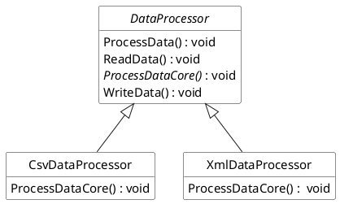
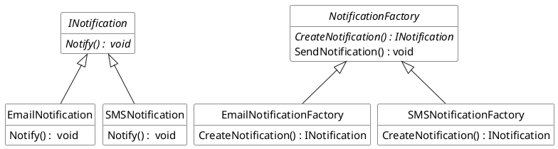
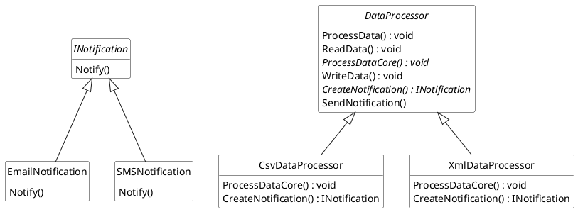

## Design exercises

Design patterns are proven solutions to common design problems. They provide a way to structure code so that modifications, extensions, and maintenance become easier without starting from scratch. 

This workshop provides hands-on experiences in object-oriented design using two essential design patterns:
- **Template Method Pattern:** Used to define the skeleton of an algorithm in an abstract class and let subclasses override individual steps without changing the overall algorithm’s structure.
- **Factory Method Pattern:** Used to abstract the process of object creation, letting subclasses decide which objects to instantiate.

---
#### Exercise A

The Template Method pattern allows you to create an abstract class that outlines the steps (or “template”) of an algorithm. Some steps are implemented in the base class while others are left abstract—forcing subclasses to implement their own behavior. This pattern is widely used when a series of operations always occurs in the same order, yet parts of that sequence may vary depending on the scenario.

Imagine a data processing pipeline system where you need to read data, process it, and write back the results. The overall process remains the same, but the data format (e.g., CSV versus XML) affects the implementation of the processing step.

The class diagram below shows the inheritance relationship where both `CsvDataProcessor` and `XmlDataProcessor` inherit from `DataProcessor`. They must implement the abstract `ProcessDataCore()` method while inheriting the concrete steps from the base class.

Implement this data processing system using the Template Method pattern. The `ProcessData()` method in the abstract `DataProcessor` class should define a fixed skeleton of steps: read, process, and write. The `ProcessDataCore()` method is abstract so that each subclass (e.g., `CsvDataProcessor` or `XmlDataProcessor`) can provide its custom data processing logic without altering the structure of the overall algorithm. For each concrete method, you can print out a simple message indicating its functionality, such as “Processing CSV data…”, “Processing XML data…”, “Reading data from the source…”, or “Writing processed data to the destination…”.

---
#### Exercise B

The Factory Method pattern encapsulates object creation by defining an interface for creating objects and letting subclasses decide which class to instantiate. This pattern is especially useful when a system should be independent of how its objects are created, composed, or represented.

Consider a notification system that needs to send notifications via different channels such as Email or SMS. Instead of having client code specify these concrete classes directly, you can use a Factory Method to abstract the creation process, thereby making it easier to add new notification types in the future.

The following class diagram shows the relationship between the `NotificationFactory` and its concrete implementations. Each concrete factory is responsible for producing an object that implements the `INotification` interface, thereby decoupling the client from the instantiation process.

Implement this notification system using the Factory Method pattern. The abstract class `NotificationFactory` should declare the factory method `CreateNotification()`, which is an abstract method in this example. The subclasses (`EmailNotificationFactory` and `SMSNotificationFactory`) override this method to instantiate specific notification types (either `EmailNotification` or `SMSNotification`). The client code interacts with the abstract class rather than the specific notification classes, ensuring loose coupling and future extensibility.

---
#### Exercise C

Finally, let’s combine the **Template Method** and **Factory Method** design patterns into a cohesive example that utilise both patterns in action. This integration demonstrates how these two patterns may complement each other in a  real-world scenario: one for structuring algorithms and the other for abstracting object creation.

The unified example will simulate a **Data Reporting System**, which processes data from various formats (like CSV and XML) and sends a notification to inform users about the completion of the data processing task. The Template Method pattern is used to define the sequence of steps in data processing, while the Factory Method pattern handles the creation of appropriate notification types (Email or SMS).

Based on the above class diagram, implement this data reporting system using both the Template Method and Factory Method patterns.
1. Template Method Pattern:
   - The `DataProcessor` class defines the skeleton of the data processing algorithm (read, process, write, and notify).
   - Subclasses like `CsvDataProcessor` and `XmlDataProcessor` implement the specific details for each data format.
1. Factory Method Pattern:
   - The `DataProcessor` defines the factory method `CreateNotification()`.
   - Concrete classes like `CsvDataProcessor` and `XmlDataProcessor` decide which type of notification to create. For this example, email notification is used for the former, and SMS notification for the latter.
   - The `DataProcessor` class uses the factory method to create and send notifications after processing data.
