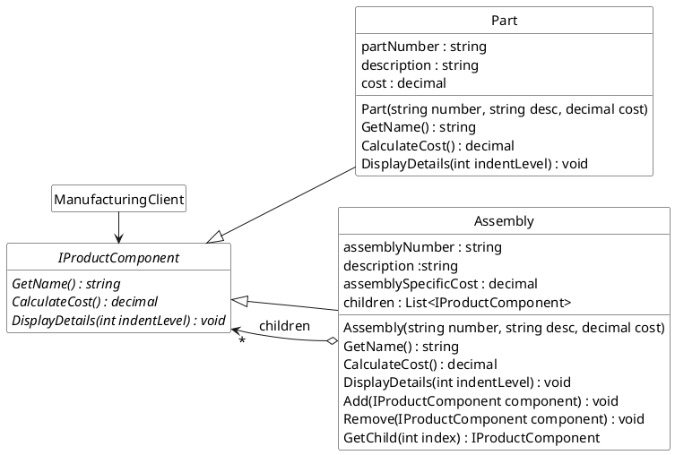
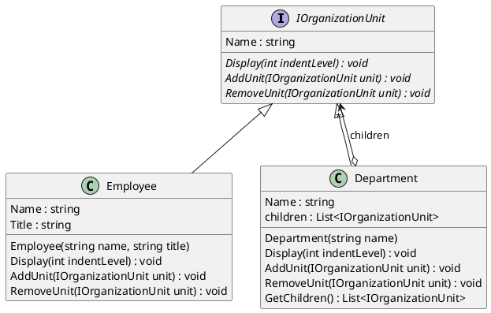
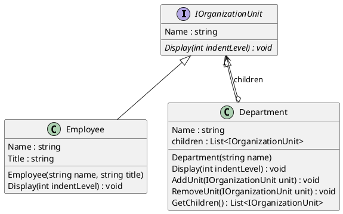

## Design Exercises

#### Exercise A



Design Choice Note: The diagram comments on whether child management methods (`Add`, `Remove`, `GetChild`) belong in the `IProductComponent` interface or only in the `Assembly` class.
- **In Interface (Uniformity):** Clients can call `Add`/`Remove` on any `IProductComponent`. Simplifies client code _if_ they need to modify the structure, but `Part` must implement them (e.g., by throwing `NotSupportedException`), which can lead to runtime errors if not handled carefully.
- **Only in Composite (Safety):** Type safety is better. Clients _know_ only `Assembly` objects can have children added/removed. However, clients needing to modify the tree must explicitly check if an object `is Assembly` and cast it before calling `Add`/`Remove`.

For the C# example below, we'll place `Add`/`Remove` only in the `Assembly` class (Safety approach), but be aware of the alternative.

```csharp
// --- Component Interface ---
public interface IProductComponent
{
    string Name { get; }
    decimal CalculateCost();
    void DisplayDetails(int indentLevel);
}

// --- Leaf Class ---
public class Part : IProductComponent
{
    public string PartNumber { get; }
    public string Description { get; }
    public decimal Cost { get; }

    public string Name => $"{PartNumber} ({Description})";

    public Part(string partNumber, string description, decimal cost)
    {
        PartNumber = partNumber;
        Description = description;
        Cost = cost;
        if (cost < 0) throw new ArgumentOutOfRangeException(nameof(cost), "Cost cannot be negative.");
    }

    public decimal CalculateCost()
    {
        // Simple leaf: cost is just its own cost
        return Cost;
    }

    public void DisplayDetails(int indentLevel)
    {
        Console.WriteLine($"{new string('-', indentLevel)} Part: {Name}, Cost: ${CalculateCost():F2}");
    }
}

// --- Composite Class ---
public class Assembly : IProductComponent
{
    private readonly List<IProductComponent> _children = new List<IProductComponent>();

    public string AssemblyNumber { get; }
    public string Description { get; }
    public decimal AssemblySpecificCost { get; } // e.g., Labor cost for this assembly level

    public string Name => $"{AssemblyNumber} ({Description})";

    public Assembly(string assemblyNumber, string description, decimal assemblySpecificCost = 0)
    {
        AssemblyNumber = assemblyNumber;
        Description = description;
        AssemblySpecificCost = assemblySpecificCost;
        if (assemblySpecificCost < 0) throw new ArgumentOutOfRangeException(nameof(assemblySpecificCost), "Assembly cost cannot be negative.");
    }

    // --- Child Management Methods (Specific to Assembly) ---
    public void AddComponent(IProductComponent component)
    {
        if (component == null) throw new ArgumentNullException(nameof(component));
        _children.Add(component);
    }

    public void RemoveComponent(IProductComponent component)
    {
        _children.Remove(component);
    }

    public IReadOnlyList<IProductComponent> GetChildren()
    {
        return _children.AsReadOnly();
    }
    // --- IProductComponent Implementation ---

    public decimal CalculateCost()
    {
        // Composite: cost is its specific cost plus sum of children's costs
        decimal totalChildCost = _children.Sum(child => child.CalculateCost());
        return AssemblySpecificCost + totalChildCost;
    }

    public void DisplayDetails(int indentLevel)
    {
        Console.WriteLine($"{new string('+', indentLevel)} Assembly: {Name}, Assembly Cost: ${AssemblySpecificCost:F2}, Total Cost: ${CalculateCost():F2}");
        foreach (var child in _children)
        {
            // Recursively display children
            child.DisplayDetails(indentLevel + 2);
        }
    }
}

// --- Client Code ---
public class ManufacturingClient
{
    public static void Run()
    {
        Console.WriteLine("Building Complex Product BOM:");

        // Create individual parts
        var bolt = new Part("B001", "Standard Bolt M8", 0.10m);
        var sensor = new Part("S345", "Temperature Sensor", 25.50m);
        var blade = new Part("TB99", "Turbine Blade", 150.75m);
        var casing = new Part("C012", "Sensor Casing", 5.20m);

        // Create sub-assemblies
        var sensorAssembly = new Assembly("SA-100", "Sensor Module", 10.00m); // $10 assembly cost
        sensorAssembly.AddComponent(sensor);
        sensorAssembly.AddComponent(casing);
        for (int i = 0; i < 4; i++) // Add 4 bolts
        {
            sensorAssembly.AddComponent(new Part("B001", "Standard Bolt M8", 0.10m));
        }


        var turbineWheel = new Assembly("TW-200", "Turbine Wheel", 50.00m); // $50 assembly cost
        for (int i = 0; i < 20; i++) // Add 20 blades
        {
            turbineWheel.AddComponent(new Part("TB99", $"Turbine Blade #{i + 1}", 150.75m));
        }

        // Create main assembly (e.g., Engine Core)
        var engineCore = new Assembly("EC-001", "Engine Core Assembly", 500.00m); // $500 assembly cost
        engineCore.AddComponent(sensorAssembly);
        engineCore.AddComponent(turbineWheel);
        engineCore.AddComponent(new Part("ECP-01", "Core Frame", 350.00m));

        // --- Use the Composite Structure Uniformly ---

        Console.WriteLine("\n--- Detailed BOM Structure & Costs ---");
        // Display details for the entire engine core. Notice the client treats 'engineCore'
        // via the IProductComponent interface for DisplayDetails.
        engineCore.DisplayDetails(0);

        Console.WriteLine("\n---------------------------------------");

        // Calculate total cost. Again, uses the common interface method.
        decimal totalCost = engineCore.CalculateCost();
        Console.WriteLine($"Total Calculated Cost for {engineCore.Name}: ${totalCost:F2}");

        Console.WriteLine("\n--- Calculating cost of a sub-assembly ---");
        // We can calculate cost of any component uniformly
        Console.WriteLine($"Cost of {sensorAssembly.Name}: ${sensorAssembly.CalculateCost():F2}");

        Console.WriteLine("\n--- Calculating cost of a single part ---");
        Console.WriteLine($"Cost of {blade.Name}: ${blade.CalculateCost():F2}");


        // --- Modifying the structure (requires knowing it's an Assembly) ---
        Console.WriteLine("\n--- Adding a new part to Sensor Assembly ---");
        var mountingBracket = new Part("MB-05", "Mounting Bracket", 3.50m);
        // Note: We need to call AddComponent on the specific Assembly instance.
        // If Add/Remove were in the interface, we might need a cast or type check depending on implementation.
        sensorAssembly.AddComponent(mountingBracket);

        Console.WriteLine("\n--- Updated BOM Structure & Costs ---");
        engineCore.DisplayDetails(0);
        Console.WriteLine($"\nNew Total Calculated Cost for {engineCore.Name}: ${engineCore.CalculateCost():F2}");

    }
}

public class Program
{
    public static void Main(string[] args)
    {
        ManufacturingClient.Run();
    }
}
```


---
#### Exercise B

###### Variant 1: Uniformity



```csharp

// --- Component Interface (with Child Management) ---
public interface IOrganizationUnit
{
    string Name { get; }
    void Display(int indentLevel);
    // Child management methods declared here for uniformity
    void AddUnit(IOrganizationUnit unit);
    void RemoveUnit(IOrganizationUnit unit);
}

// --- Leaf Class ---
public class Employee : IOrganizationUnit
{
    public string Name { get; }
    public string Title { get; }

    public Employee(string name, string title)
    {
        Name = name;
        Title = title;
    }

    public void Display(int indentLevel)
    {
        Console.WriteLine($"{new string('-', indentLevel)} Employee: {Name} ({Title})");
    }

    // Leaves cannot have children, so these methods throw exceptions
    public void AddUnit(IOrganizationUnit unit)
    {
        throw new NotSupportedException($"{Name} is an Employee and cannot have sub-units added.");
    }

    public void RemoveUnit(IOrganizationUnit unit)
    {
        throw new NotSupportedException($"{Name} is an Employee and cannot have sub-units removed.");
    }
}

// --- Composite Class ---
public class Department : IOrganizationUnit
{
    private readonly List<IOrganizationUnit> _children = new List<IOrganizationUnit>();
    public string Name { get; }

    public Department(string name)
    {
        Name = name;
    }

    public void Display(int indentLevel)
    {
        Console.WriteLine($"{new string('+', indentLevel)} Department: {Name}");
        foreach (var child in _children)
        {
            child.Display(indentLevel + 2);
        }
    }

    // Functional implementation for adding children
    public void AddUnit(IOrganizationUnit unit)
    {
        if (unit == null) throw new ArgumentNullException(nameof(unit));
        _children.Add(unit);
        Console.WriteLine($"-- Added {unit.Name} to {this.Name} --");
    }

    // Functional implementation for removing children
    public void RemoveUnit(IOrganizationUnit unit)
    {
        if (_children.Remove(unit))
        {
            Console.WriteLine($"-- Removed {unit.Name} from {this.Name} --");
        }
        else
        {
            Console.WriteLine($"-- Unit {unit.Name} not found in {this.Name} --");
        }

    }

    public IReadOnlyList<IOrganizationUnit> GetChildren()
    {
        return _children.AsReadOnly();
    }
}

// --- Client Code ---
public static class OrgChartClient_Uniformity
{
    public static void Run()
    {
        Console.WriteLine("### Running Uniformity Variant ###");

        IOrganizationUnit ceo = new Employee("Alice", "CEO");
        IOrganizationUnit tech = new Department("Technology");
        IOrganizationUnit hr = new Department("Human Resources");
        IOrganizationUnit engineering = new Department("Engineering");
        IOrganizationUnit ops = new Department("Operations");

        IOrganizationUnit engLead = new Employee("Bob", "Engineering Lead");
        IOrganizationUnit dev1 = new Employee("Charlie", "Software Developer");
        IOrganizationUnit dev2 = new Employee("David", "Software Developer");
        IOrganizationUnit opsLead = new Employee("Eve", "Operations Lead");
        IOrganizationUnit hrManager = new Employee("Frank", "HR Manager");
        IOrganizationUnit recruiter = new Employee("Grace", "Recruiter");


        // Build the hierarchy - notice we can call AddUnit directly
        // on 'tech', 'hr', 'engineering', 'ops' because they are IOrganizationUnit
        // and the interface guarantees the AddUnit method exists.
        tech.AddUnit(engineering);
        tech.AddUnit(ops);
        engineering.AddUnit(engLead);
        engineering.AddUnit(dev1);
        engineering.AddUnit(dev2);
        ops.AddUnit(opsLead);
        hr.AddUnit(hrManager);
        hr.AddUnit(recruiter);

        // Create top-level structure (e.g., a Root Department or just add top levels to a list)
        var company = new Department("MegaCorp");
        company.AddUnit(ceo); // Add CEO (Employee) to company
        company.AddUnit(tech); // Add Tech Dept to company
        company.AddUnit(hr);   // Add HR Dept to company

        Console.WriteLine("\n--- Initial Org Chart ---");
        company.Display(0);

        Console.WriteLine("\n--- Attempting Modification (Uniformity) ---");
        // We can *try* to add to an employee - this compiles fine!
        try
        {
            Console.WriteLine($"\nAttempting to add 'recruiter' under employee 'dev1'...");
            dev1.AddUnit(recruiter); // This will throw NotSupportedException at RUNTIME
        }
        catch (NotSupportedException ex)
        {
            Console.WriteLine($"ERROR: {ex.Message}");
        }

        // Successfully remove an employee
        Console.WriteLine($"\nAttempting to remove 'dev2' from 'engineering'...");
        engineering.RemoveUnit(dev2);

        Console.WriteLine("\n--- Org Chart After Removing Dev2 ---");
        company.Display(0);


        Console.WriteLine("\n### Uniformity Variant Finished ###\n");
    }
}
public class Program
{
    public static void Main(string[] args)
    {
        OrgChartClient_Uniformity.Run();
    }
}
```

###### Variant 2: Type Safety



```csharp
    // --- Component Interface (NO Child Management) ---
    public interface IOrganizationUnit
    {
        string Name { get; }
        void Display(int indentLevel);
        // NO AddUnit / RemoveUnit here
    }

    // --- Leaf Class (Simpler) ---
    public class Employee : IOrganizationUnit
    {
        public string Name { get; }
        public string Title { get; }

        public Employee(string name, string title)
        {
            Name = name;
            Title = title;
        }

        public void Display(int indentLevel)
        {
            Console.WriteLine($"{new string('-', indentLevel)} Employee: {Name} ({Title})");
        }
        // No need to implement AddUnit/RemoveUnit
    }

    // --- Composite Class ---
    public class Department : IOrganizationUnit
    {
        private readonly List<IOrganizationUnit> _children = new List<IOrganizationUnit>();
        public string Name { get; }

        public Department(string name)
        {
            Name = name;
        }

        public void Display(int indentLevel)
        {
            Console.WriteLine($"{new string('+', indentLevel)} Department: {Name}");
            foreach (var child in _children)
            {
                child.Display(indentLevel + 2);
            }
        }

        // --- Child Management Methods (Specific to Department) ---
        public void AddUnit(IOrganizationUnit unit)
        {
            if (unit == null) throw new ArgumentNullException(nameof(unit));
            _children.Add(unit);
            Console.WriteLine($"-- Added {unit.Name} to {this.Name} --");
        }

        public void RemoveUnit(IOrganizationUnit unit)
        {
            if (_children.Remove(unit))
            {
                Console.WriteLine($"-- Removed {unit.Name} from {this.Name} --");
            }
            else
            {
                Console.WriteLine($"-- Unit {unit.Name} not found in {this.Name} --");
            }
        }

        public IReadOnlyList<IOrganizationUnit> GetChildren()
        {
            return _children.AsReadOnly();
        }
    }

    // --- Client Code ---
    public static class OrgChartClient_TypeSafety
    {
        public static void Run()
        {
            Console.WriteLine("### Running Type Safety Variant ###");

            // Object creation is the same...
            IOrganizationUnit ceo = new Employee("Alice", "CEO");
            // We need Department references to add children
            var tech = new Department("Technology");
            var hr = new Department("Human Resources");
            var engineering = new Department("Engineering");
            var ops = new Department("Operations");

            var engLead = new Employee("Bob", "Engineering Lead");
            var dev1 = new Employee("Charlie", "Software Developer");
            var dev2 = new Employee("David", "Software Developer");
            var opsLead = new Employee("Eve", "Operations Lead");
            var hrManager = new Employee("Frank", "HR Manager");
            var recruiter = new Employee("Grace", "Recruiter");


            // Build the hierarchy - we MUST have Department references
            // or cast IOrganizationUnit references to call AddUnit.
            tech.AddUnit(engineering); // tech is already Department var
            tech.AddUnit(ops);         // ops is already Department var

            // If engineering were only an IOrganizationUnit reference:
            // IOrganizationUnit engineeringUnit = engineering;
            // engineeringUnit.AddUnit(engLead); // COMPILE ERROR! IOrganizationUnit has no AddUnit

            // We must use the Department reference:
            engineering.AddUnit(engLead);
            engineering.AddUnit(dev1);
            engineering.AddUnit(dev2);
            ops.AddUnit(opsLead);
            hr.AddUnit(hrManager);
            hr.AddUnit(recruiter);


            var company = new Department("MegaCorp");
            company.AddUnit(ceo); // Add CEO (Employee)
            company.AddUnit(tech); // Add Tech Dept
            company.AddUnit(hr);   // Add HR Dept

            Console.WriteLine("\n--- Initial Org Chart ---");
            company.Display(0); // Display works uniformly via interface

            Console.WriteLine("\n--- Attempting Modification (Type Safety) ---");

            // Try to add to an employee - COMPILE ERROR
            // dev1.AddUnit(recruiter); // Error CS1061: 'Employee' does not contain a definition for 'AddUnit'...

            // To modify, we often need type checks and casts if we only have an IOrganizationUnit ref
            Console.WriteLine($"\nAttempting to add 'recruiter' under 'engineering' (using type check)...");
            IOrganizationUnit targetUnit = engineering; // Imagine we only have this interface ref

            if (targetUnit is Department targetDept)
            {
                Console.WriteLine($"'{targetUnit.Name}' is a Department. Adding '{recruiter.Name}'.");
                targetDept.AddUnit(recruiter); // Safely call AddUnit after check/cast
            }
            else
            {
                Console.WriteLine($"Cannot add units to '{targetUnit.Name}' as it is not a Department.");
            }

            // Try adding to an employee unit using the same pattern
            Console.WriteLine($"\nAttempting to add 'recruiter' under 'dev1' (using type check)...");
            targetUnit = dev1;
            if (targetUnit is Department targetDept2) // This check will fail
            {
                Console.WriteLine($"'{targetUnit.Name}' is a Department. Adding '{recruiter.Name}'.");
                targetDept2.AddUnit(recruiter);
            }
            else
            {
                Console.WriteLine($"Cannot add units to '{targetUnit.Name}' as it is not a Department.");
            }

            // Successfully remove an employee using the Department reference
            Console.WriteLine($"\nAttempting to remove 'dev2' from 'engineering'...");
            engineering.RemoveUnit(dev2);


            Console.WriteLine("\n--- Org Chart After Modifications ---");
            company.Display(0);

            Console.WriteLine("\n### Type Safety Variant Finished ###\n");
        }
    }

    public class Program
    {
        public static void Main(string[] args)
        {
            OrgChartClient_TypeSafety.Run();
        }
    }
```
