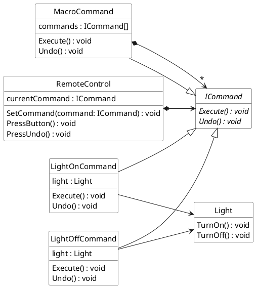
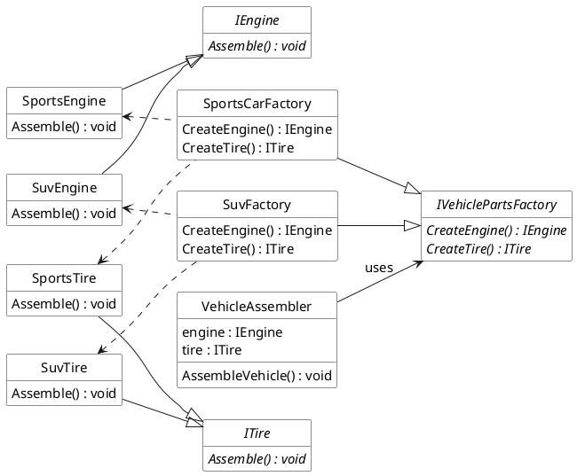

## Design Exercises

#### Exercise A

This class diagram illustrates the relationship between the objects in our smart home Command pattern design.



This sample C# code demonstrates the Command pattern in action.

```csharp

// The Command Interface declares the execution and undo methods.
public interface ICommand
{
    void Execute();
    void Undo();
}

// The Receiver class: a simple Light device.
public class Light
{
    public void TurnOn()
    {
        Console.WriteLine("Light is ON");
    }

    public void TurnOff()
    {
        Console.WriteLine("Light is OFF");
    }
}

// Concrete Command to turn the light on.
public class LightOnCommand : ICommand
{
    private Light light;

    public LightOnCommand(Light light)
    {
        this.light = light;
    }

    public void Execute()
    {
        light.TurnOn();
    }

    public void Undo()
    {
        light.TurnOff();
    }
}

// Concrete Command to turn the light off.
public class LightOffCommand : ICommand
{
    private Light light;

    public LightOffCommand(Light light)
    {
        this.light = light;
    }

    public void Execute()
    {
        light.TurnOff();
    }

    public void Undo()
    {
        light.TurnOn();
    }
}


// The Invoker class encapsulates a command and can execute or undo it.
public class RemoteControl
{
    private ICommand currentCommand;

    public void SetCommand(ICommand command)
    {
        currentCommand = command;
    }

    public void PressButton()
    {
        currentCommand.Execute();
    }

    public void PressUndo()
    {
        currentCommand.Undo();
    }
}


// MacroCommand aggregates several ICommand objects.
public class MacroCommand : ICommand
{
    private ICommand[] commands;

    public MacroCommand(ICommand[] commands)
    {
        this.commands = commands;
    }

    public void Execute()
    {
        foreach (var command in commands)
            command.Execute();
    }

    public void Undo()
    {
        // The reverse order can help correctly undo complex sequences.
        for (int i = commands.Length - 1; i >= 0; i--)
            commands[i].Undo();
    }
}

public class Client
{
    public static void Main(string[] args)
    {
        // Setup the receiver
        Light livingRoomLight = new Light();

        // Create concrete commands for the receiver
        ICommand lightOn = new LightOnCommand(livingRoomLight);
        ICommand lightOff = new LightOffCommand(livingRoomLight);

        // Setup the invoker
        RemoteControl remote = new RemoteControl();

        // Simulate turning the light on and off with undo capability
        remote.SetCommand(lightOn);
        remote.PressButton();   // Light is ON
        remote.PressUndo();     // Light is OFF

        remote.SetCommand(lightOff);
        remote.PressButton();   // Light is OFF
        remote.PressUndo();     // Light is ON

        // Using a MacroCommand to simulate a "Good Night" sequence
        ICommand[] goodNightCommands = { lightOff /*, add DoorLockCommand, AlarmOnCommand, etc. */ };
        ICommand goodNightMacro = new MacroCommand(goodNightCommands);

        remote.SetCommand(goodNightMacro);
        remote.PressButton();   // Executes all commands in the macro
        remote.PressUndo();     // Undoes all commands in reverse order
    }
}
```


---

#### Exercise B


This class diagram captures the relationships in this Abstract Factory design.




This C# code example demonstrates the Abstract Factory pattern in our vehicle parts manufacturing system. It shows how switching the factory dynamically produces entirely different product families without changing the client code.

```csharp
// Product A: Engine Interface
public interface IEngine
{
    void Assemble();
}

// Product B: Tire Interface
public interface ITire
{
    void Assemble();
}

// SportsCar products
public class SportsEngine : IEngine
{
    public void Assemble()
    {
        System.Console.WriteLine("Assembling a high-performance sports engine.");
    }
}

public class SportsTire : ITire
{
    public void Assemble()
    {
        System.Console.WriteLine("Assembling low-profile, high-grip sports tires.");
    }
}

// SUV products
public class SuvEngine : IEngine
{
    public void Assemble()
    {
        System.Console.WriteLine("Assembling a fuel-efficient, robust SUV engine.");
    }
}

public class SuvTire : ITire
{
    public void Assemble()
    {
        System.Console.WriteLine("Assembling durable, all-terrain SUV tires.");
    }
}

public interface IVehiclePartsFactory
{
    IEngine CreateEngine();
    ITire CreateTire();
}


public class SportsCarFactory : IVehiclePartsFactory
{
    public IEngine CreateEngine()
    {
        return new SportsEngine();
    }

    public ITire CreateTire()
    {
        return new SportsTire();
    }
}

// Concrete Factory for SUVs
public class SuvFactory : IVehiclePartsFactory
{
    public IEngine CreateEngine()
    {
        return new SuvEngine();
    }

    public ITire CreateTire()
    {
        return new SuvTire();
    }
}

public class VehicleAssembler
{
    private IEngine engine;
    private ITire tire;

    public VehicleAssembler(IVehiclePartsFactory factory)
    {
        engine = factory.CreateEngine();
        tire = factory.CreateTire();
    }

    public void AssembleVehicle()
    {
        engine.Assemble();
        tire.Assemble();
        System.Console.WriteLine("Vehicle assembly completed.\n");
    }
}

public class Client
{
    public static void Main(string[] args)
    {
        // For a Sports Car
        IVehiclePartsFactory sportsFactory = new SportsCarFactory();
        VehicleAssembler sportsAssembler = new VehicleAssembler(sportsFactory);
        System.Console.WriteLine("Assembling Sports Car:");
        sportsAssembler.AssembleVehicle();

        // For an SUV
        IVehiclePartsFactory suvFactory = new SuvFactory();
        VehicleAssembler suvAssembler = new VehicleAssembler(suvFactory);
        System.Console.WriteLine("Assembling SUV:");
        suvAssembler.AssembleVehicle();
    }
}
```

